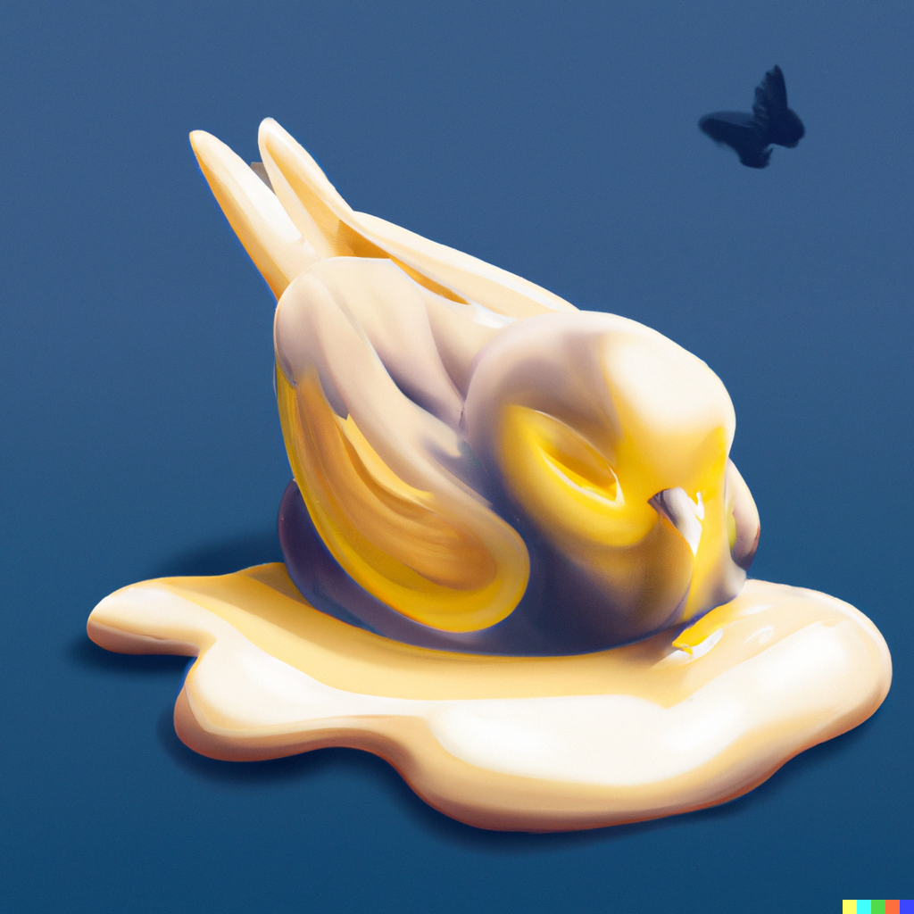

# Butter

    

Butter is a replacement for Flutter. Also includes a replacement for dart called bart. 
This is half a joke but I would really like to make it once I have time. In the far far future.

## Motivation

Create a UI framework + language that makes sense. When you have 12 libraries to manage simple state then maybe you are doing something wrong. 

Flutter wrote the whole stack from the ground up including renderer and language and still it has a crazy amount of boilerplate.
Creating a stateless widget requires you to write the same name 6 times. Insanity. 

## Overview

## Example

Here is a simple buttton and some text

    Main :: proc() {
        pressed := false

        if Button("Click me") {
            pressed = true
        }

        if(pressed) {
            Text("The button was pressed", size=16)
        } else {
            Text("Press the button", color=.red)
        }
    }

In Butter the entire frame is redrawn 60 times per second*. Rendering logic and input logic is combined. 
The Button() function returns true when the button is clicked, executing the contents of the if statement.
No need for callbacks. Here is a more complicated example:

    Main :: proc() {
        sliderValue : F32 = 1.0
        userName: String = ""
        
        RowLayout(crossAlign: .bottom) toggle {
            Text("Enter username")
            EditBox(&userName, maxLength=32)
        }

        Text($"Edit cool value: {sliderValue}")
        Slider(&sliderValue, min=0, max=10, step=0.5)
    }

Bart has some features that help in creating readable code. The name of the Align enum does not have to be included.  
The toggle keyword calls a combination of PushRowLayout and PopLayout at the end of the scope after toggle. This is equivalent to writing 

    PushRowLayout(align=.start)
    Text("Enter username")
    EditBox(&userName, maxLength=32)
    PopRowLayout()

Since a lot of operations in butter happen in a stack, the toggle keyword creates concise and readable code and makes nesting optional. Note that RowLayout(), and the widgets Text(), EditBox() etc are all functions, not objects.

Butter keeps track of an implicit context where the current layout and other details are stored. The default layout is always a column layout.

Butter does not hide its optimization details. You need to optimize manually. If a widget does not need repainting or updating, it is your responsibility to handle this. 

    ComplicatedThing :: proc(someText: String) -> bool {
        if RepaintCache(repaintOn=.hover|.scale) toggle {
            for i := 1..<20 {
                TextWithLotsOfExpensiveGraphics(someText, quality=.veryHigh, size=12)
            }
        }
    }

The contents inside the if-statement are only executed when this widget requires repainting.

## Implementation

At first Butter will be an interpreted language. The interpreter is written in GoLang.

## Roadmap

### 2023: The Churning of Butter

#### 1. **The Great Unpacking**  
*Before we spread, we churn.*
- Unpack the foundational building blocks of Butter. 
- Begin with the interpretation mechanism.
- Basic REPL (Read-Eval-Print Loop) development. Because let's face it, what's a language without a way to shout at it and get some answers?

#### 2. **Windows Wonders**  
*The window to Butter's soul.*
- Roll out the primary platform layer for Windows. 

#### 3. **OpenGL Goodness**  
*Smooth graphics, smoother UI.*
- Dive into the world of 2D graphics. 
- Develop rendering capabilities for buttery smooth primitives like rectangles, circles, and text.

### 2024: Butter Gets Spread

#### 4. **Bart's Big Break**  
*Everyone's favorite secondary star steps into the limelight.*
- Enhancement of the Bart language. 
- Standard library development, focusing on essential utilities and, of course, UI components.
  
#### 5. **Cross-Platform Capers**  
*Butter is too good to be restricted.*
- Explore beyond Windows. MacOS, Linux, mobile platforms? The world is our bread slice!

#### 6. **2D Graphics Galore**  
*Adding the sprinkles on our toast.*
- Introduce advanced 2D graphic capabilities, like gradients, animations, and maybe even a dab of 3D!
